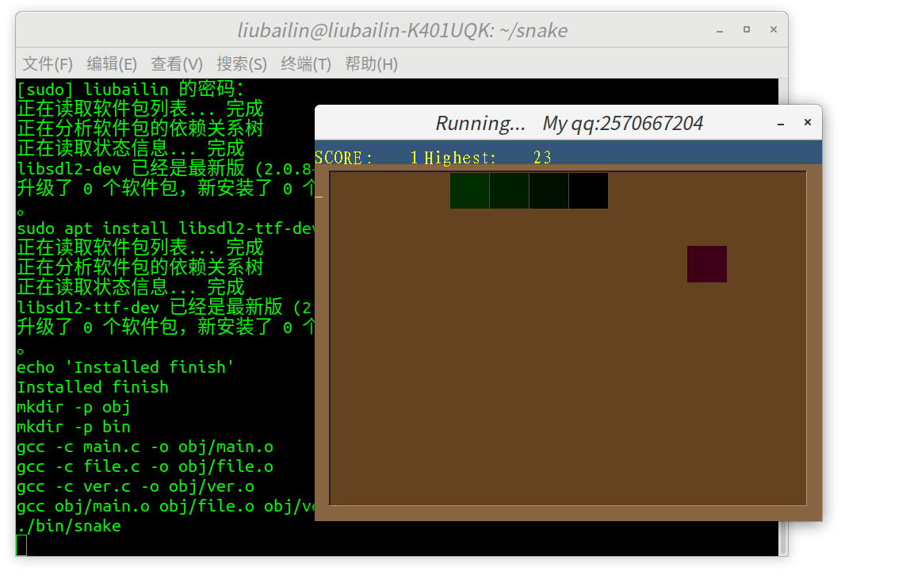

## 一个贪食蛇

# Note！！！
  我的环境是ubuntu 18.04 其它版本ubuntu，应该能编译(使用apt下载依赖库），但是不保证，没有经过测试。 
如果要在其它linux发形版下编译，暂时不支持make命令，你可以自己手动下载对应的库，编译，本项目依赖库为：

SDL2

SDL2_ttf
## 特别
1. SDL是跨平台的图形库，因此你可以很容易的移植到windows上面，甚至是手机上。
2. 其实本程序在windows上调试完成,然后再移到linux所以中文可能乱码,编码 utf-8 用vim打开要乱码,不知道为什么!

## 编译
$ make build
## 安装
$ make install
## 运行
$ snake

## 本程序可自由分享，修改不用通知作者,但引用请注明出处. 
